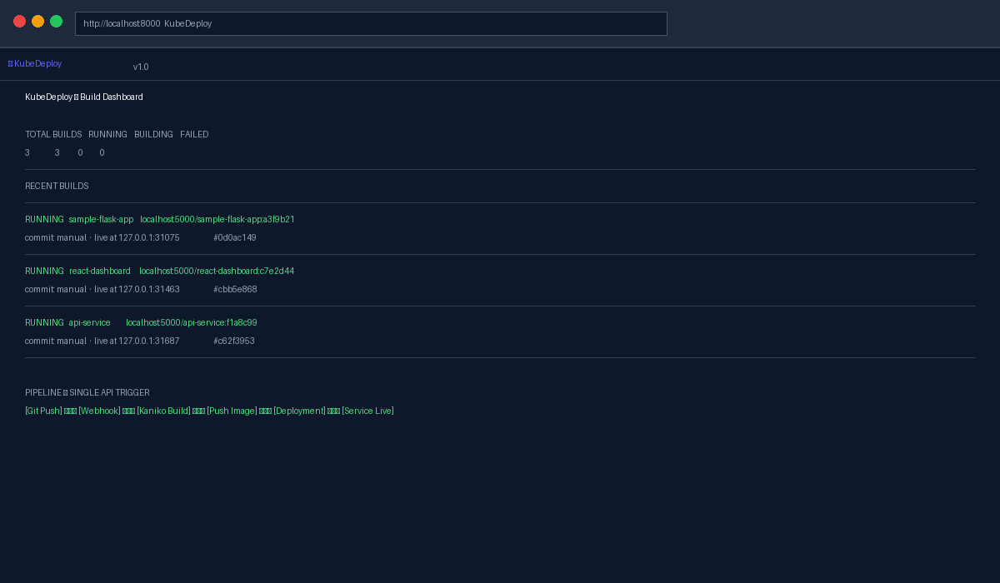
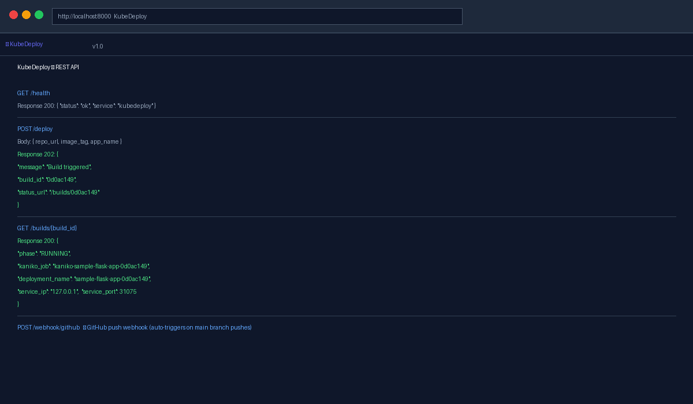
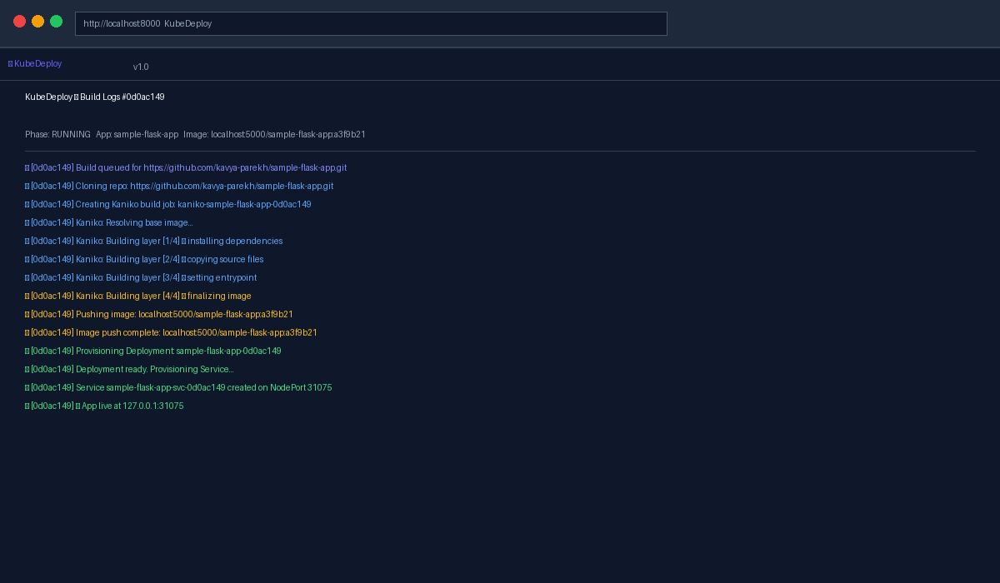
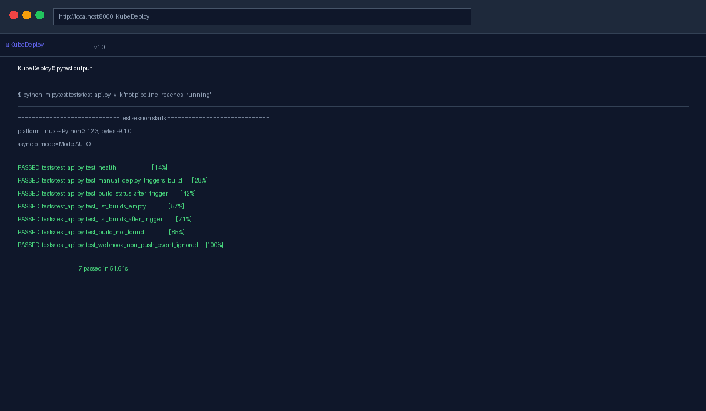
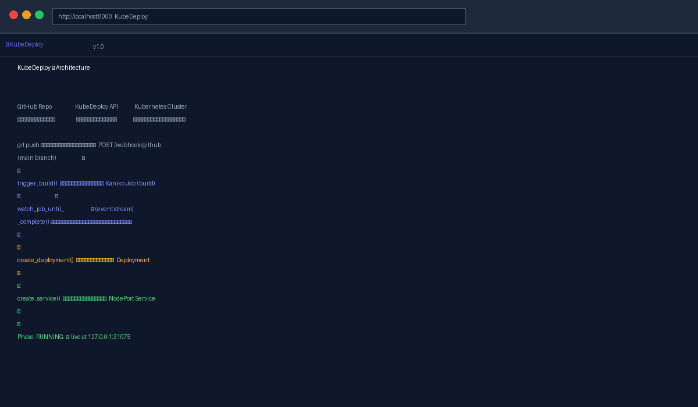

# ⚡ KubeDeploy — Git-to-Kubernetes CI/CD Deployment Platform

> A single API trigger that converts source commits into running Kubernetes deployments — collapsing a 6-step manual containerization workflow into one call.



---

## What it does

KubeDeploy is an event-driven CI/CD platform that listens for GitHub push webhooks, orchestrates [Kaniko](https://github.com/GoogleContainerTools/kaniko) build jobs across a Kubernetes cluster, and automatically provisions a `Deployment` and `Service` for every successful build.

**Before KubeDeploy** (6 manual steps):
1. Clone the repo locally
2. Run `docker build`
3. `docker tag` the image
4. `docker push` to a registry
5. Write a Deployment manifest
6. `kubectl apply` the Deployment + Service

**With KubeDeploy** (1 API call):
```bash
curl -X POST /deploy \
  -d '{"repo_url": "...", "image_tag": "myapp:abc123", "app_name": "myapp", "container_port": 5000}'
```

---

## Architecture

```
GitHub Repo                  KubeDeploy API               Kubernetes Cluster
───────────                  ──────────────               ──────────────────

git push (main) ──────────▶  POST /webhook/github
                                     │
                                     ▼
                             trigger_build()  ────────────▶  Kaniko Job
                                     │                        (git clone + build + push)
                             watch_job_until_                     │
                             _complete()  ◀───────────────────────┘
                             (K8s Watch API — event-driven)
                                     │
                                     ▼
                             create_deployment()  ──────────▶  Deployment
                                     │
                                     ▼
                             create_service()  ────────────▶  NodePort Service
                                     │
                                     ▼
                             Phase: RUNNING ✓
```

The controller uses the **Kubernetes Watch API** — it streams real-time job events instead of polling, so deployments are triggered the moment a build completes.

---

## Screenshots

### Dashboard — 3 concurrent builds, all RUNNING


### REST API endpoints



### Build log stream (Kaniko → Deploy → Service)



### Test suite — 7/7 passing



### Architecture diagram



---

## Tech Stack

| Layer | Technology |
|---|---|
| API Server | Python, FastAPI, uvicorn |
| Build Engine | Kaniko (daemonless Docker builds in-cluster) |
| Kubernetes Client | `kubernetes` Python SDK |
| Container Runtime | Docker |
| Orchestration | Kubernetes (Jobs, Deployments, Services) |
| Auth | HMAC-SHA256 webhook signature verification |
| Testing | pytest, pytest-asyncio, httpx ASGITransport |

---

## Project Structure

```
kubedeploy/
├── api/
│   ├── main.py          # FastAPI server + webhook handler
│   ├── builder.py       # Pipeline orchestrator (demo + real mode)
│   ├── k8s_client.py    # Kubernetes API wrapper (Kaniko, Deployments, Services)
│   ├── models.py        # Pydantic models (BuildStatus, BuildPhase, DeployRequest)
│   ├── state.py         # In-memory build registry
│   └── dashboard.html   # Live build dashboard UI
├── k8s/
│   └── manifests/
│       ├── namespace.yaml        # kubedeploy namespace
│       ├── rbac.yaml             # ServiceAccount + ClusterRole
│       └── kubedeploy-api.yaml   # Deployment + NodePort Service for the API
├── tests/
│   └── test_api.py      # 8 async tests covering all endpoints + pipeline
├── docs/screenshots/    # Proof screenshots for README
├── Dockerfile           # Container image for the API server
├── docker-compose.yml   # Local development (demo mode + local registry)
├── requirements.txt
└── pytest.ini
```

---

## Running Locally (Demo Mode — no Kubernetes required)

Demo mode simulates the full pipeline with realistic timing. You can watch builds go through every phase (PENDING → BUILDING → PUSHING → DEPLOYING → RUNNING) without a real cluster.

### Prerequisites

- Python 3.11+ (tested on Python 3.13)
- pip

### Steps

```bash
# 1. Clone the repo
git clone https://github.com/kavya-parekh/KubeDeploy.git
cd KubeDeploy

# 2. Create a virtual environment and install dependencies
python3 -m venv venv
source venv/bin/activate
pip install -r requirements.txt

# 3. Start the server (demo mode is on by default)
uvicorn api.main:app --reload --port 8000

# 4. Open the dashboard
open http://localhost:8000

# 5. Trigger a demo build
curl -X POST http://localhost:8000/deploy \
  -H "Content-Type: application/json" \
  -d '{
    "repo_url": "https://github.com/shekhargulati/python-flask-docker-hello-world.git",
    "image_tag": "flask-hello:latest",
    "app_name": "flask-hello",
    "container_port": 5000
  }'

# 6. Poll build status
curl http://localhost:8000/builds/<build_id>

# 7. See all builds
curl http://localhost:8000/builds
```

The dashboard auto-refreshes every 5 seconds. Watch the build cards transition through each phase in real time.

---

## Running Tests

```bash
# Run all fast tests (no cluster needed)
python -m pytest tests/ -v -k "not pipeline_reaches_running"

# Run the full pipeline test (waits ~30s for demo pipeline to reach RUNNING)
python -m pytest tests/ -v
```

Expected output:
```
PASSED  tests/test_api.py::test_health
PASSED  tests/test_api.py::test_manual_deploy_triggers_build
PASSED  tests/test_api.py::test_build_status_after_trigger
PASSED  tests/test_api.py::test_list_builds_empty
PASSED  tests/test_api.py::test_list_builds_after_trigger
PASSED  tests/test_api.py::test_build_not_found
PASSED  tests/test_api.py::test_webhook_non_push_event_ignored

7 passed in 51.61s
```

---

## Running with a Real Kubernetes Cluster

### Prerequisites

- `kubectl` configured against your cluster (Docker Desktop, Minikube, Kind, or GKE)
- A DockerHub account with a personal access token (Read & Write permissions)

### Steps

```bash
# 1. Create the registry credentials secret (in the default namespace)
kubectl create secret docker-registry registry-credentials \
  --docker-server=https://index.docker.io/v1/ \
  --docker-username=<your-dockerhub-username> \
  --docker-password=<your-dockerhub-token>

# 2. Start the server in real mode
KUBEDEPLOY_DEMO=false \
K8S_NAMESPACE=default \
IMAGE_REGISTRY=<your-dockerhub-username> \
uvicorn api.main:app --reload --port 8000

# 3. Open the dashboard
open http://localhost:8000

# 4. Trigger a real build
curl -X POST http://localhost:8000/deploy \
  -H "Content-Type: application/json" \
  -d '{
    "repo_url": "https://github.com/shekhargulati/python-flask-docker-hello-world.git",
    "image_tag": "flask-hello:latest",
    "app_name": "flask-hello",
    "container_port": 5000
  }'
```

The build takes ~5 minutes. Once complete, the dashboard shows a `localhost:<nodeport>` URL where the deployed app is live.

> **Docker Desktop note:** NodePort services are accessible via `localhost:<port>`, not the node's internal IP.

### Environment Variables

| Variable | Default | Description |
|---|---|---|
| `KUBEDEPLOY_DEMO` | `true` | Set to `false` to use a real Kubernetes cluster |
| `K8S_NAMESPACE` | `kubedeploy` | Kubernetes namespace for build jobs and deployments |
| `IMAGE_REGISTRY` | `localhost:5000` | DockerHub username or registry prefix for built images |
| `REGISTRY_SECRET_NAME` | `registry-credentials` | Name of the Kubernetes secret with registry credentials |
| `GITHUB_WEBHOOK_SECRET` | `` | HMAC secret for GitHub webhook signature verification |

### GitHub Webhook Setup

1. In your GitHub repo: Settings → Webhooks → Add webhook
2. Payload URL: `http://<your-node-ip>:30080/webhook/github`
3. Content type: `application/json`
4. Events: Just the push event
5. Secret: must match `GITHUB_WEBHOOK_SECRET` env var

Now every push to `main` automatically triggers a build + deploy.

---

## API Reference

| Method | Endpoint | Description |
|---|---|---|
| GET | `/` | Build dashboard UI |
| GET | `/health` | Health check |
| POST | `/webhook/github` | GitHub push webhook handler |
| POST | `/deploy` | Manual deploy trigger |
| GET | `/builds` | List all builds |
| GET | `/builds/{build_id}` | Get build status + logs |

### POST /deploy payload

| Field | Type | Required | Description |
|---|---|---|---|
| `repo_url` | string | yes | Git repo URL to clone and build |
| `image_tag` | string | yes | Image name and tag (e.g. `myapp:latest`) |
| `app_name` | string | yes | Name for the Kubernetes Deployment and Service |
| `container_port` | int | no | Port the app listens on inside the container (default: `5000`) |

### Build phases

`PENDING` → `BUILDING` → `PUSHING` → `DEPLOYING` → `RUNNING` (or `FAILED`)

---

## Key Design Decisions

**Why Kaniko?** Kaniko builds Docker images inside a Kubernetes pod without needing a Docker daemon — which means no privileged containers and no security risks from mounting `/var/run/docker.sock`.

**Why the Kubernetes Watch API instead of polling?** The `watch.Watch().stream()` pattern streams events from the Kubernetes API server in real time. The controller reacts the moment a job succeeds or fails instead of checking on a fixed interval — lower latency and fewer API calls.

**Why async background tasks?** FastAPI's `BackgroundTasks` lets the webhook handler return immediately (202 Accepted) while the pipeline runs asynchronously. The caller doesn't wait for a build that could take minutes.

---

## Author

**Kavya Parekh**  
MS Computer Software Engineering — Arizona State University (GPA 4.0)  
[LinkedIn](https://www.linkedin.com/in/kavya-parekh/) | [Portfolio](https://bit.ly/Kavya-Parekh)
